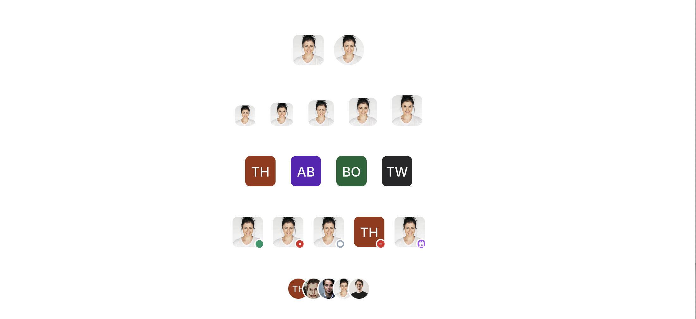
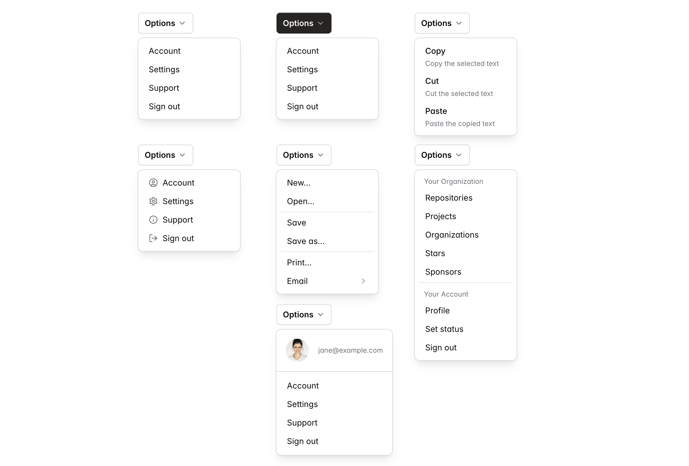
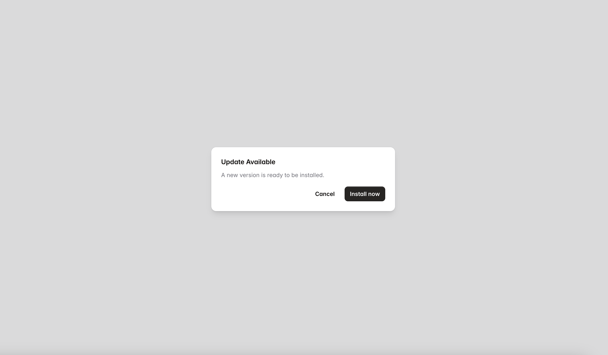
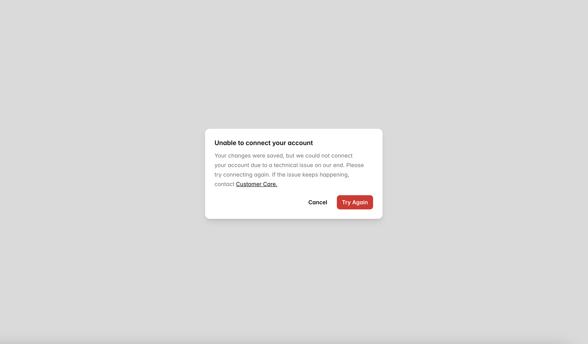
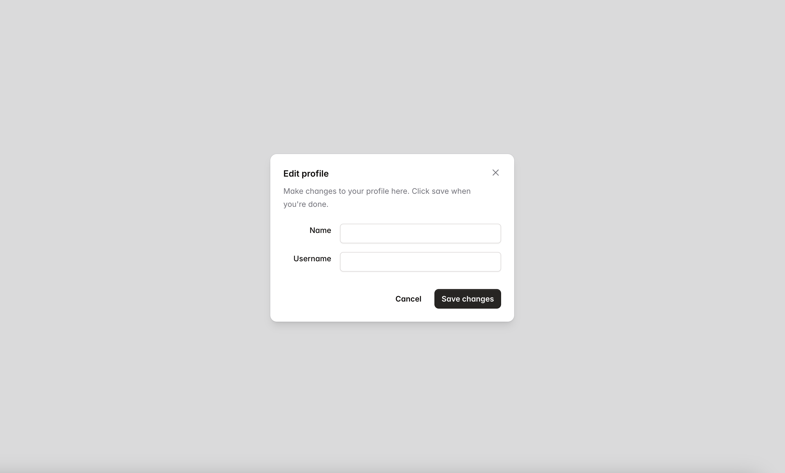
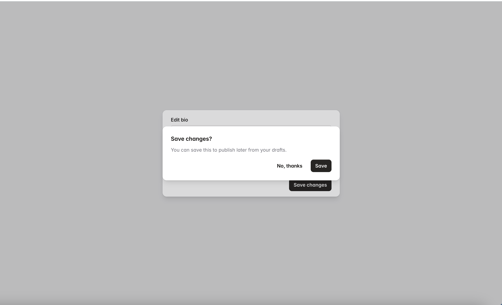
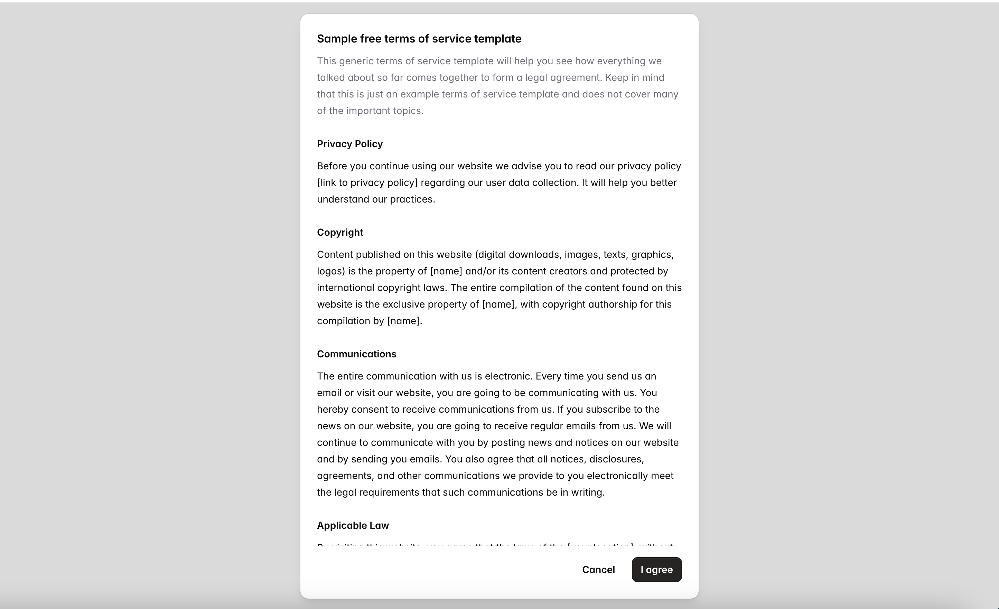
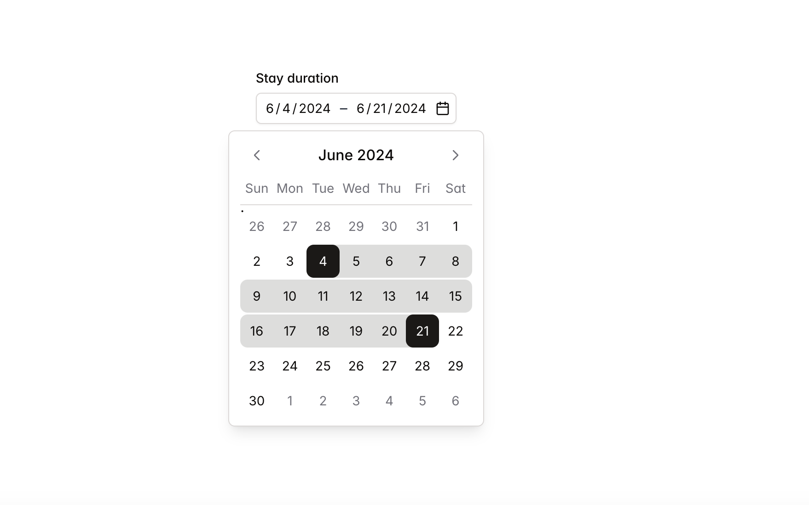
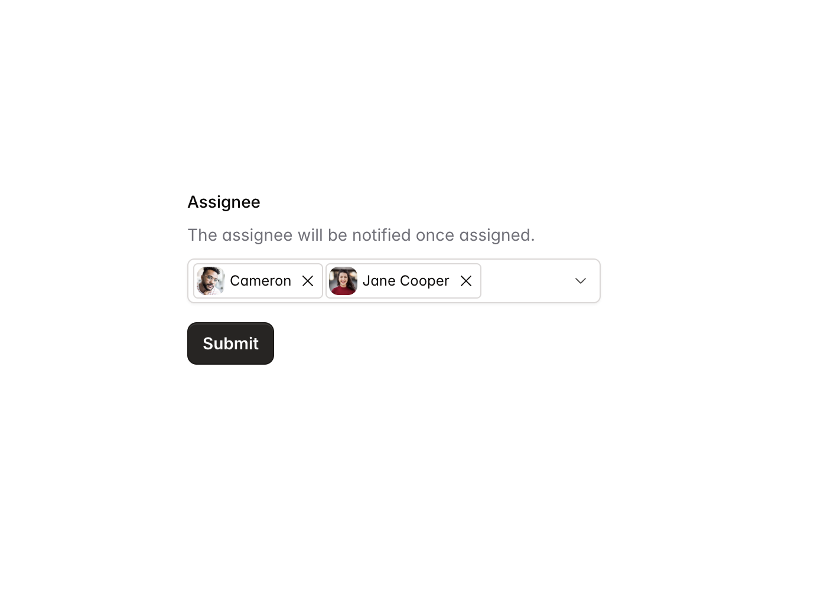

# Tailwind React Aria Components Starter kits

This project is heavily inspired by below amazing projects:

- [react-aria-tailwind-starter](https://react-spectrum.adobe.com/react-aria-tailwind-starter/?path=/docs/alertdialog--docs)
- [Tailwind Catalyst](https://tailwindui.com/templates/catalyst)
- [shadcn/ui](https://ui.shadcn.com/docs)

If you are looking for something like [Tailwind Catalyst](https://tailwindui.com/templates/catalyst) but using [React Aria Component](https://react-spectrum.adobe.com/react-aria/components.html), give it a try.

## Installation

**This is NOT a component library**. It just contains re-usable and styled components that you can copy and past to your project.

1. Set up [tailwindCSS](https://tailwindcss.com/docs/installation)
2. Install

```shell
npm i react-aria-components
npm i tailwindcss-animate
npm i tailwind-merge
npm i tailwindcss-react-aria-components
npm i @tailwindcss/container-queries
# if you want to use the HoverCard component
npm i @floating-ui/react
```

3. Edit your tailwind.config.js file using [./tailwind.config.js](./tailwind.config.js)

4. Copy components from **`src`** to your project

Visit the storybook page - https://zaichaopan.github.io/tailwind-react-aria-components-starter-kits to explore all available components.

















