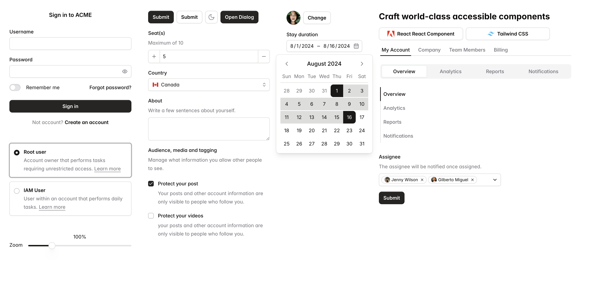

# React Aria Components Tailwind Starter



This project is heavily inspired by below amazing projects.

- <a href="https://react-spectrum.adobe.com/react-aria-tailwind-starter/?path=/docs/alertdialog--docs" target="_blank">React Aria Tailwind Starter</a>
- <a href="https://tailwindui.com/templates/catalyst" target="_blank">Tailwind Catalyst</a>
- <a href="https://ui.shadcn.com/docs" target="_blank">Shadcn UI</a>
- <a href="https://nextui.org" target="_blank">NextUI</a>

## Installation

**This is *NOT* a component library**. It just contains re-usable and styled components that you can copy and paste to your project.

1. Set up [tailwindCSS](https://tailwindcss.com/docs/installation)
2. Install

```shell
npm i react-aria-components
npm i react-stately
npm i react-aria
npm i tailwindcss-react-aria-components
npm i tailwindcss-animate
npm i @tailwindcss/container-queries
npm i tailwind-merge
# Only if you want to use the HoverCard component
npm i @floating-ui/react
```

3. Edit your tailwind.config.js file using [./tailwind.config.js](./tailwind.config.js)

4. Copy components from **`src`** to your project

5. Add css from **`src/theme`** to your project


Visit the storybook page - <a href="https://zaichaopan.github.io/react-aria-components-tailwind-starter" target="_blank" >React Aria Components Tailwind Starter</a> to explore all available components.
