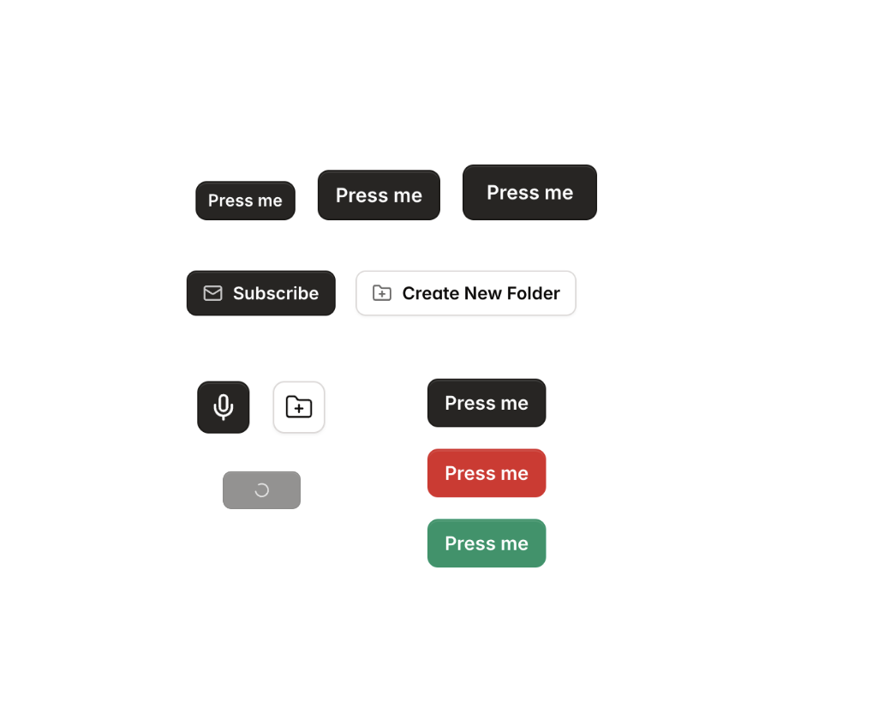

# Tailwind React Aria Components Starter kits

Tailwind React Aria Components Starter kits is heavily inspired by below amazing projects:

- [react-aria-tailwind-starter](https://react-spectrum.adobe.com/react-aria-tailwind-starter/?path=/docs/alertdialog--docs)
- [Tailwind Catalyst](https://tailwindui.com/templates/catalyst)
- [shadcn/ui](https://ui.shadcn.com/docs)

It aims to address the shortage of high-quality UI components for React Aria Components. While the official [react-aria-tailwind-starter](https://react-spectrum.adobe.com/react-aria-tailwind-starter/?path=/docs/alertdialog--docs) is excellent for learning how to use React Aria Components with Tailwind, it may not be suitable for production use. On the other hand, [Tailwind Catalyst](https://tailwindui.com/templates/catalyst) has outstanding UI design, but is based on [Headless UI](https://github.com/tailwindlabs/headlessui). Meanwhile, [shadcn/ui](https://ui.shadcn.com/docs) is built using [Radix UI](https://www.radix-ui.com).

## Documentation

Visit the storybook page - https://zaichaopan.github.io/tailwind-react-aria-components-starter-kits to view the documentation

